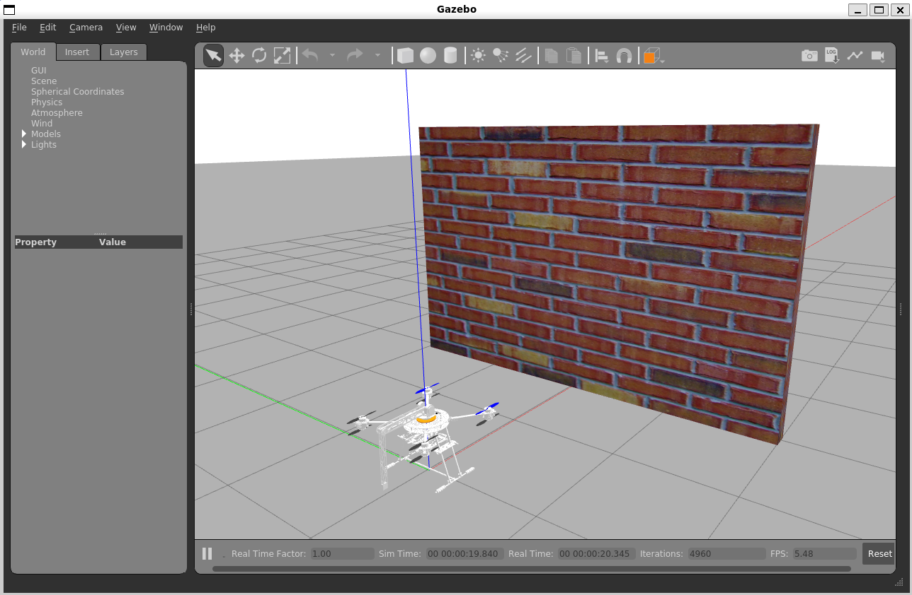

# Sarax on Docker container
> [!CAUTION]\
> The purpose of the Docker container is to provide a portable and isolated environment for testing. It is not advised for production use-cases.

## Using the container
> [!NOTE]
> The following procedure assumes that Docker is setup and installed properly

### Pulling the container from GHCR
This repository creates and publishes a Docker container onto the GitHub Container Registry as a [package](https://github.com/Arief-AK/sarax/pkgs/container/sarax-framework). The container can be pulled with the command below.
```shell
docker pull ghcr.io/arief-ak/sarax-framework:latest
```
### Building the container
Optionally, the container can be built using the [Dockerfile](../Dockerfile) in the source. This can be done after cloning the repository and building the [Dockerfile](../Dockerfile) with the command below.
```shell
docker build .
```

For both procedures, a Docker image is produced as shown below.
```shell
REPOSITORY                         TAG          IMAGE ID       CREATED       SIZE
ghcr.io/arief-ak/sarax-framework   latest       b4d3bbec4f9d   3 days ago    8.65GB
```
## Using the container (with GUI)
> [!WARNING]
> The GUI on the container is slow and unstable

The Docker container can produce GUI for Gazebo simulator. This can be done by running the following procedure referenced from the [PX4-Autopilot Docker container reference](https://docs.px4.io/main/en/test_and_ci/docker.html).

On the host machine, allow access for xhost from the container and setup authorisation
```shell
xhost local:root && XAUTH=/tmp/.docker.xauth
```

Create the container using the following command. Make sure to use the correct `IMAGE_ID` for the Docker container from the host system.
```shell
docker run -it --name sarax_container --env="DISPLAY=$DISPLAY" \
    --env="QT_X11_NO_MITSHM=1" \
    -v /tmp/.X11-unix:/tmp/.X11-unix:rw \
    --env="XAUTHORITY=$XAUTH" \
    -v $XAUTH:$XAUTH \
    --network host \
    --privileged \
    <IMAGE_ID> bash
```

Once inside the container, head to the Sarax workspace and follow the [Run the Simulation](../README.md#run-the-simulation) procedure in the [README](../README.md). This should run the Gazebo simulator.

