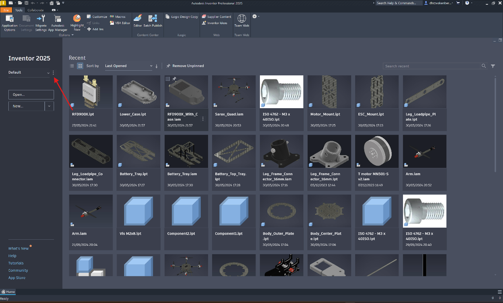
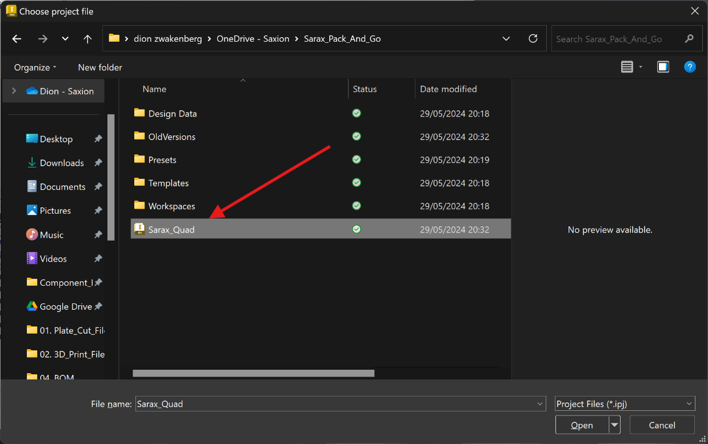
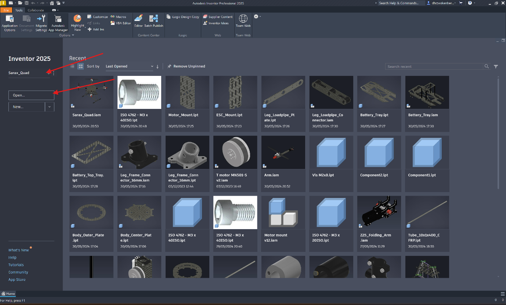
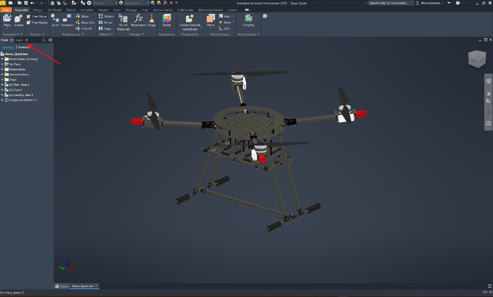
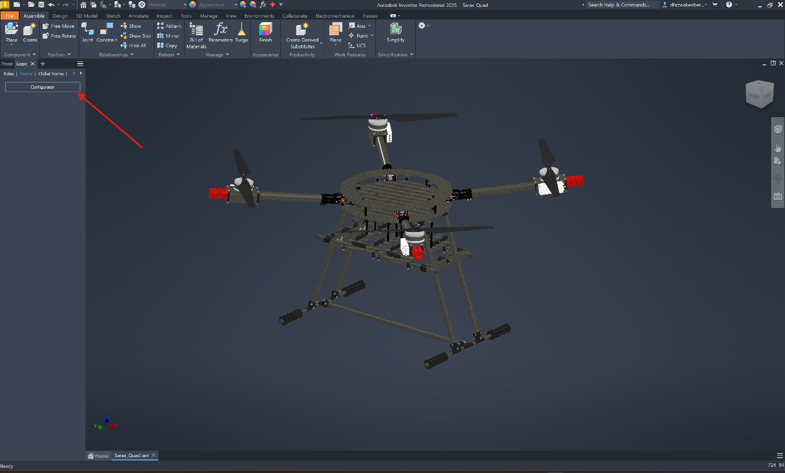
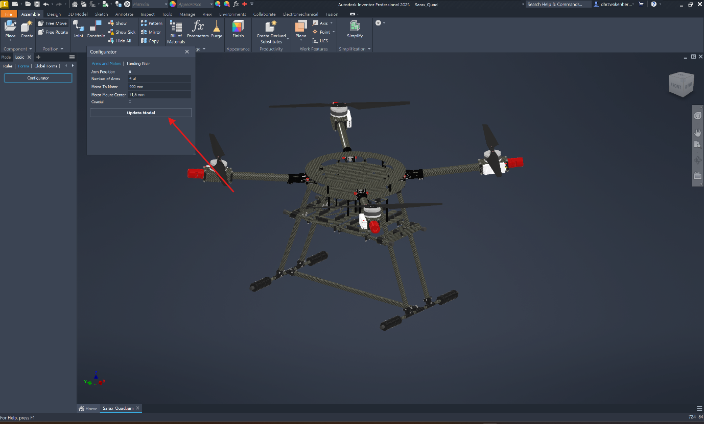

# Welcome to the hardware repository of Sarax. 
This repository contains the preliminary versions (V0) of our models, which are still under
development. Most essential components are included, and many features
and files. We are working on finalizing the drawings, Bill of Materials
(BOM), and cleaning up the file structure.

# Contents

## Current Contents

### Sarax (UAS)

-   **3D Model:** Parametric design of Sarax

-   **Production Drawings**: Includes 3D print files and DXF files for
    laser cutting, water jet cutting, and CNC machining

-   **BOM**: Bill of materials with all parts to purchase and/or
    manufacture

### SAM (Saxion Aerial Manipulator)

-   **3D Model:** Design of SAM

-   **Production Drawings:** Includes 3D print files and DXF files for
    laser cutting, water jet cutting, and CNC machining

# Future Plans

In the near future, we will upload the properly structured (V1) version
of the models. This version will include:

### Sarax (UAS)

-   **3D Model:** Parametric design of Sarax

-   **Production Drawings:** Includes 3D print files and DXF files for
    laser cutting, water jet cutting, and CNC machining

-   **BOM:** Lists for three configurations (quad, hexa, octa)

-   **Suggested Hardware List**

-   **Gazebo Models:** Configurations for quad, hexa, and octa

-   **Guide:** Instructions for using the files and building Sarax

### SAM (Saxion Aerial Manipulator)

-   **3D Model:** Design of SAM

-   **Production Drawings:** Includes 3D print files and DXF files for
    laser cutting, water jet cutting, and CNC machining

-   **BOM:** Lists for two configurations (2DOF, 3DOF)

-   **Gazebo Models:** Configurations for 2DOF and 3DO

-   **Guide:** Instructions for using the files and building SAM

In a later state we will also enhance the parametric capabilities of the
models to automatically generate production drawings, Gazebo models,
BOMs, and more based on user-defined parameters.

# Note

Drawings are made in Autodesk Inventor, which offers free individual
licenses to students without requiring whole school registration.

# How to open the Sarax file

-   First you have to get access to Autodesk Inventor, you can apply for
    an education access via [Autodesk](https://www.autodesk.com/education/edu-software/overview). After
    you get access install Autodesk Inventor according to the Autodesk
    instructions.

-   Second download the Sarax Hardware Repository

-   Next you should perform the following steps

1.  Open Autodesk Inventor and click on the 3 dots to open settings
    {width="6.268055555555556in"
    height="3.783685476815398in"}

2.  In settings click
    Browse{width="6.268055555555556in"
    height="5.79093394575678in"}

3.  Navigate to the main Sarax directory open the Sarax_Public.ipj file
    {width="5.632194881889764in"
    height="3.53125in"}

4.  If done correctly you will see Sarax_Public under Project name, then
    click done {width="6.268055555555556in"
    height="5.79093394575678in"}

5.  Click open {width="6.268055555555556in"
    height="3.783685476815398in"}

6.  In Workspaces \> Workspace \> Sarax \> 01.CAD \> 01. 3D_Drawing \>
    open the Sarax_Quad.iam file (If Autodesk Inventor asks to update
    the assembly click
    "Yes"{width="6.268055555555556in"
    height="3.7859055118110234in"}

7.  To open parameters click the iLogic Button
    {width="6.268055555555556in"
    height="3.783685476815398in"}

8.  Click
    Configurator{width="6.268055555555556in"
    height="3.783685476815398in"}

9.  Now you can change the parameters. After changing parameters click
    "Update Model" {width="6.268055555555556in"
    height="3.783685476815398in"}

# How to open the SAM file

-   First you have to get access to Autodesk Inventor, you can apply for
    an education access via
    <https://www.autodesk.com/education/edu-software/overview>. After
    you get access install Autodesk Inventor according to the Autodesk
    instructions.

-   Second download the SAM Hardware Repository

-   In SAM \> 01.CAD \> 01. 3D_Drawing \> open the SAM2.iam file (If
    Autodesk Inventor asks to update the assembly click "Yes"

# How to build Sarax 

## Parts

First of all this part list is not dynamic so changing the model in
Autodesk Inventor will not update the part list. This is a list to make
a basic Sarax frame with 4 arm's, 2 battery mounts, a motor to motor
span of 900mm and an landing gear with an height of 400mm

All parts of Sarax can be categorized into 2 categories buy or make
parts. In Workspaces \> Workspace \> Sarax \> 01.CAD \> 04. BOM \>
Sarax_Quadcopter_Parts.xlsx you will find the full list of parts needed
to assemble a frame.

In Workspaces \> Workspace \> Sarax \> 01.CAD \> 04. BOM \>
Purchase_List_Sarax_Quadcopter.xlsx you will find a list of all parts
that should be purchased to create the basic Sarax frame.

In Workspaces \> Workspace \> Sarax \> 01.CAD \> 04. BOM \>
Tube_Cut_List_Sarax_Quadcopter.xlsx you will find a list of all carbon
fiber tube sizes that should be purchased and cut to length to create
the basic Sarax frame.

In Workspaces \> Workspace \> Sarax \> 01.CAD \> 02. Production_Drawings
\> 01. Plate_Cut_Files \> Plate_Cut_List_Sarax_Quadcopter.xlsx you will
find a list of all parts that have to be laser/CNC cut from plate
material to create the basic Sarax frame together with the needed DXF
files to fabricate them.

In Workspaces \> Workspace \> Sarax \> 01.CAD \> 02. Production_Drawings
\> 02. 3D_Print_Files \> 3D_Print_List_Sarax_Quadcopter.xlsx you will
find a list of all parts that have to 3D printed to create the basic
Sarax frame together with the needed STL files.

## Assembly

Currently we don't have assembly instructions for Sarax so only the 3D
model can be used for reference.
